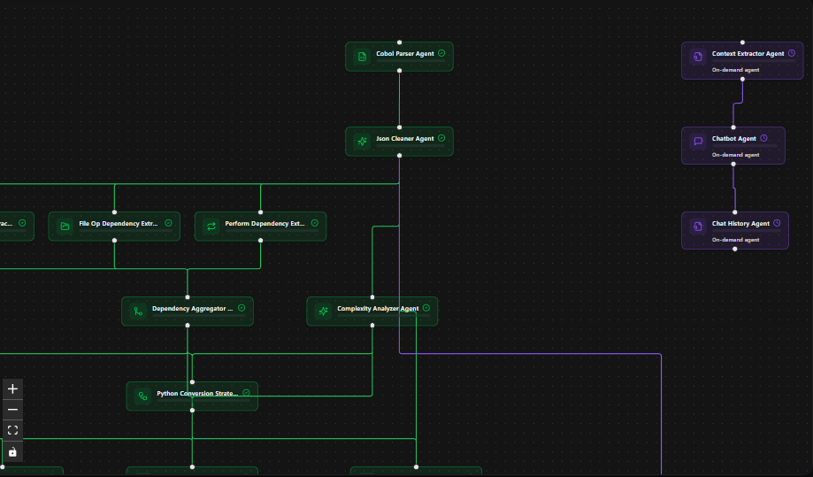
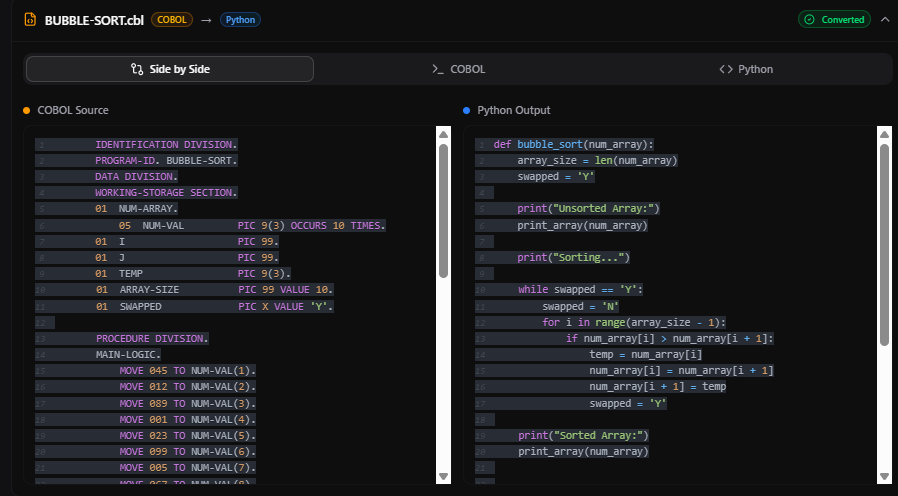
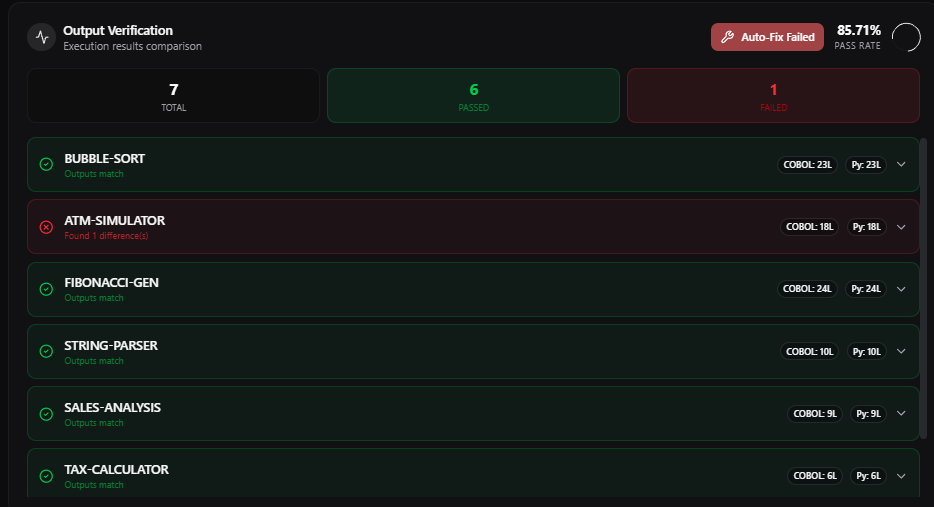
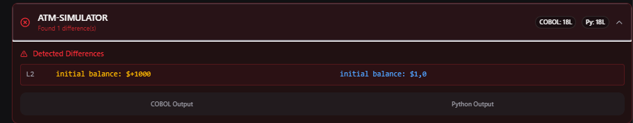
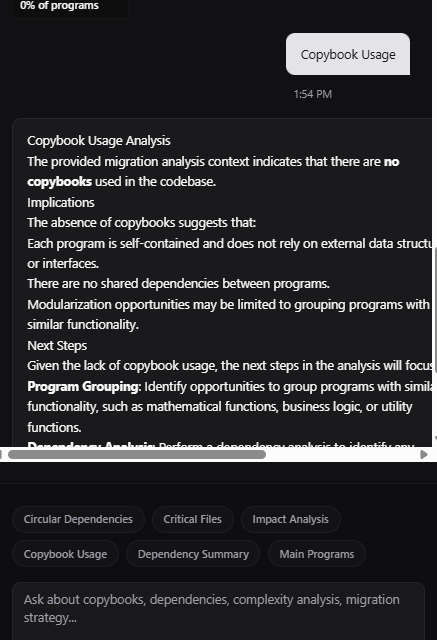
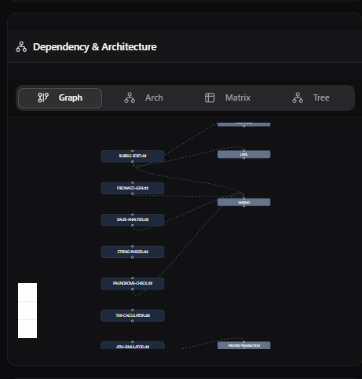
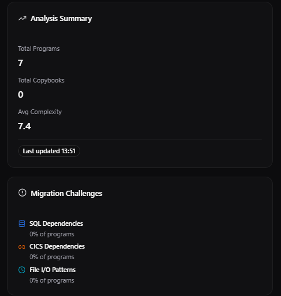
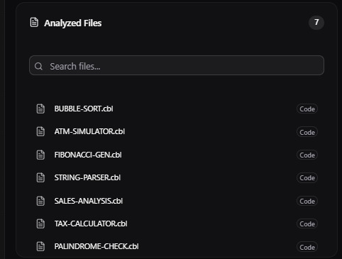
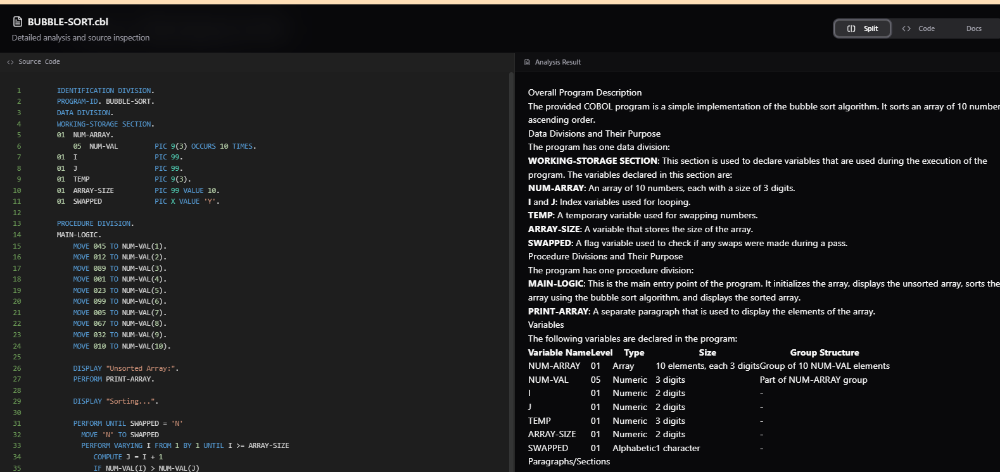
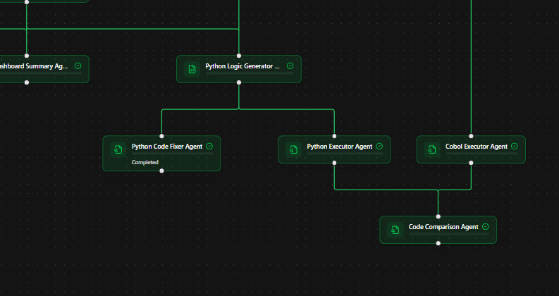

# Synco

Enterprise COBOL to Python migration platform powered by multi-agent AI orchestration using IBM watsonx.

<div align="center">
  
</div>
<br>

<table align="center">
  <tr>
    <td align="center" width="33%"></td>
    <td align="center" width="33%"></td>
    <td align="center" width="33%"></td>
  </tr>
  <tr>
    <td align="center" width="33%"></td>
    <td align="center" width="33%"></td>
    <td align="center" width="33%"></td>
  </tr>
  <tr>
    <td align="center" width="33%"></td>
    <td align="center" width="33%"></td>
    <td align="center" width="33%"></td>
  </tr>
</table>


## Overview

Synco automates mainframe modernization that analyze COBOL codebases, extract dependencies, generate Python equivalents, and verify logic equivalence through execution comparison. The system provides governed, incremental migration with audit trails and human oversight.

## Agent Categories

### Analysis Agents (Auto-Run)
- COBOL parsing and syntax analysis
- Dependency extraction (COPY, CALL, PERFORM, File I/O)
- Complexity scoring and structure insights
- Copybook usage analysis
- Mermaid diagram generation

### Conversion Agents (Auto-Run)
- Python conversion strategy generation
- COBOL to Python logic translation
- Dashboard summary creation

### Verification Agents (On-Demand)
- Python code execution in sandbox
- COBOL code execution in sandbox
- Output comparison and validation

### Intelligence Agents (On-Demand)
- Conversational Q&A with migration context
- Chat history management
- AI-powered code fixing
- Context extraction for chatbot

## Key Features

- **Dependency Intelligence**: Automatic extraction and visualization of program dependencies
- **Logic Verification**: Sandboxed execution with line-by-line output comparison
- **Iterative Refinement**: AI-powered code fixing based on execution errors
- **Human Oversight**: On-demand agents requiring explicit approval
- **Parallel Execution**: Concurrent agent processing for 3-5x speedup
- **Audit Trails**: Complete persistence of all agent results and decisions

## Installation

### Backend

```bash
cd synco-be
pip install -r requirements.txt
```

Configure environment variables:
- `IBM_CLOUD_API_KEY`: IBM Cloud API key for watsonx
- `MYSQL_*`: Database connection settings

Start the server:
```bash
uvicorn app.main:app --reload
```

### Frontend

```bash
cd synco-fe
pnpm install
pnpm dev
```

## Usage

1. **Start Migration**: Upload COBOL source files via the web interface
2. **Monitor Progress**: Watch real-time agent execution in the workflow visualization
3. **Review Results**: Examine converted Python code in the comparison panel
4. **Verify Logic**: Trigger execution agents to validate output equivalence
5. **Fix Issues**: Use the code fixer agent for iterative refinement
6. **Ask Questions**: Query the AI assistant about migration analysis

## API Endpoints

- `POST /api/v1/migration/runs` - Start new migration run
- `GET /api/v1/migration/runs/{run_id}` - Get migration status and results
- `POST /api/v1/migration/runs/{run_id}/rerun` - Rerun specific agents

## Technology Stack

**Backend**
- FastAPI
- SQLAlchemy
- IBM watsonx
- asyncio
- MySQL

**Frontend**
- React 19
- TypeScript
- Vite
- ReactFlow
- Jotai
- shadcn/ui
- TailwindCSS

## Agent Execution Flow

1. **Level 0**: COBOL parsing and JSON cleaning
2. **Level 1**: Dependency extraction (4 parallel agents)
3. **Level 2**: Dependency aggregation and copybook analysis
4. **Level 3**: Structure insights and complexity analysis
5. **Level 4**: Conversion strategy generation
6. **Level 5**: Python code generation and dashboard summary
7. **On-Demand**: Execution, verification, fixing, and chat agents


## License

MIT

## Contributing

This project was built for the IBM watsonx Orchestrate and Mainframe Modernization hackathon, demonstrating production-grade multi-agent orchestration for enterprise COBOL migration.
